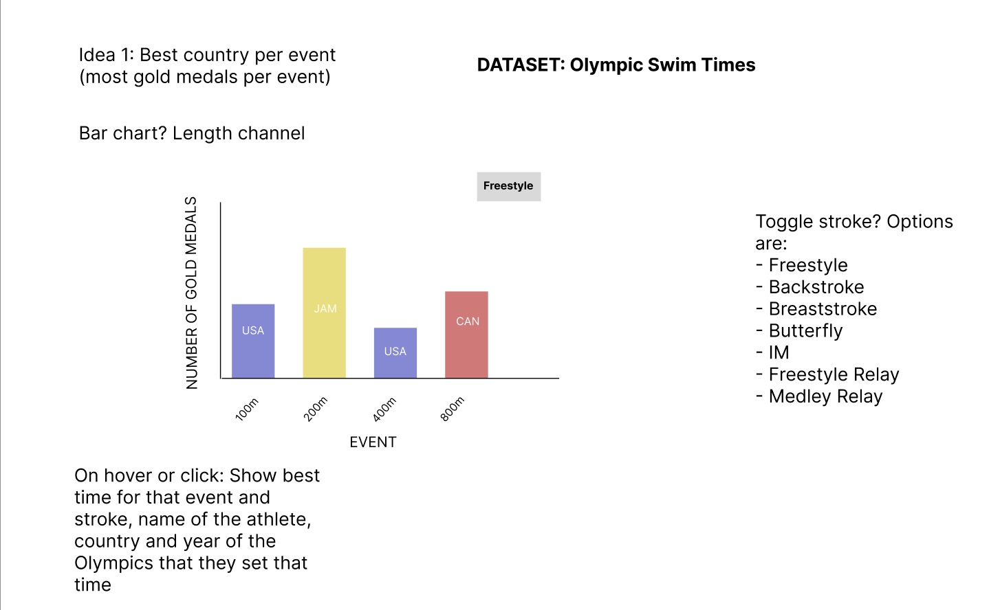

# Data Visualization Project

## Data

The data I propose to visualize for my project is [Olympic Swimming Dataset](https://www.kaggle.com/datasets/datasciencedonut/olympic-swimming-1912-to-2020)

## Questions & Tasks

The following tasks and questions will drive the visualization and interaction decisions for this project:

 * Which country is the best at each event?
 * What was the fastest time of each event?
 * Are there any patterns in which countries win which event?
 * How many complete records are there? How many will need to be discarded because of missing data?

## Sketches

- The data will be visualized in the form of a bar chart
- The X axis will have the event distances (50m, 100m, 200m, ...)
- The Y axis will have the total number of gold medals won by a country in that event across all valid Olympics (men's and women's medals combined)
- The top right of the bar chart will have a toggle to switch which stroke you are looking at (in the sketch, it says Freestyle. This will have all the strokes as options as laid out in the right side of the sketch)
- Hovering on the bar charts will hopefully show the fastest times for men and women respectively in that specific event (so for 50m freestyle, it would show the fastest man to ever swim 50m freestyle at any Olympics and the fastest woman. It will show their name, final time, and which olympics it was swam at)

## Prototypes

10/31/24
Forgot to create a new viz last week, so from now on will create new vizzes each week as I iterate. Lots of progress this week, got the medal counts per event working. This worked really well and the visualizations are interesting. I want to allow as much customization as possible in the final version but for now my priority is on creating at least an event toggle (currently you can change the event programatically but not directly on the viz) and color coding countries consistently rather than randomly. Some events aren't working so I probably need to clean the data. 
[10/31/24 progress](https://vizhub.com/aschechter10/olympic-swimming-project-version-1)

11/8/24
This week had a lot of success with the button. You can now select any Olympic event and see the viz. There is more work to be done with styling but functionality looks solid. Next week I want to make more progress with colors, interactivity and animations maybe. 
[11/8/24 progress](https://vizhub.com/aschechter10/olympic-swimming-project-2)

11/15/24
Good progress this week. Cleaned up the UI, got hover somewhat working. There is a bug where if you switch events, the hover resets the viz to 50m freestyle every time. I'll figure that out. Need to add tooltips then I'm pretty much done! Also want to look into animating the bars in and out for a nicer effect. And need to make the graph responsive. 
[11/15/24](https://vizhub.com/aschechter10/olympic-swimming-project-3)

11/22/24
Functionality is pretty much done after this week. Hovering over bars works, bars are well color-coded. There is one last bug with some of the bars not having the fastest time on hover. Will have to look into that. Last steps are also looking into animating the bars on switching of the events.
[11/22/24](https://vizhub.com/aschechter10/olympic-swimming-project-4)

## Open Questions

I'm not sure how realistic the toggle between events button will be. I'm hoping I can implement it as I feel as though it's crucial to encapsulating the dataset in the visualization well. 

## Milestones

ASAP: working prototype
2-3 weeks: Working bar chart for 1 stroke (all events showing properly on x-axis and accurate medal counts)
4-6 weeks: Ability to either hover as mentioned, or toggle strokes as mentioned
By the end: Have both hover and stroke selection working
